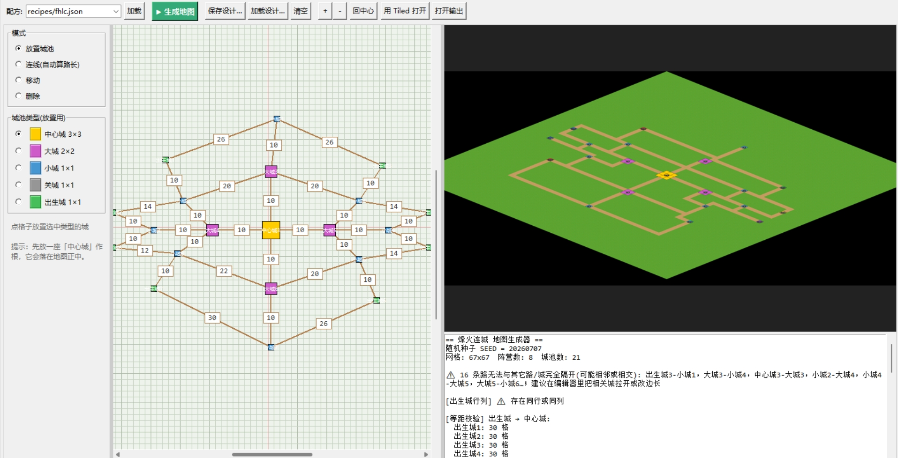

# SLG 地图编辑与生成工具 · 使用说明



给策划用的等轴测(45°) SLG 地图工具。**核心用法：在固定格子上摆城池、连路 → 一键生成 Tiled 地图 → 微调导出给程序。** 不需要懂编程。

> 想了解算法/约束/为何这么设计（改算法前必读）：见 **`DESIGN.md`**。
> 本文件只讲**怎么用**。

---

## 一、第一次使用（只做一次）
1. 安装 **Python 3.10+**（推荐 3.14）。Windows 安装时**务必勾选 `Add python.exe to PATH`**。
2. 安装依赖：命令行运行 `pip install pillow`（或直接双击任一 `.bat`，脚本会自动检测并联网安装）。
3. 安装 **Tiled**（用于微调/导出；只看预览图可不装）。

---

## 二、主要用法：拓扑编辑器（固定格子摆城）

**这是设计地图的主力工具。** 双击 **`打开拓扑编辑器.bat`**（或 `graph_editor.pyw`）打开**固定格子**画布——**一格 = 地图上的一格，摆在哪里就在地图上出现在哪里**。

### 基本流程
1. 顶部选一份**配方**（决定城池类型/尺寸/颜色/贴图）→ 点「加载」。
2. 左侧选**模式** + **城池类型**，在格子上作业：
   - **放置**：点格子落一座城。先放一座**中心城**——它会落在地图正中，红色十字标出原点。
   - **连线**：依次点两座城即连成一条路。**路长自动 = 两城的格子距离**，直接显示在路上（不用手输）。
   - **移动**：拖城到别的格子（自动吸附），相连路的距离实时更新。
   - **删除**：点城（连同它的路一起删）或点路中点删除。
3. 点 **▶ 生成地图** → 右侧出预览 + 校验报告。
4. **用 Tiled 打开** 微调；**打开输出** 查看产物。

### 要点
- **所见即所得**：城池在格子上的相对位置，就是它在生成地图上的位置；中心城恒居地图正中。
- **路长自动**：不再手填格数——城摆在哪，路的长度（曼哈顿格数 = |Δ列|+|Δ行|）就是多少，实时显示在路上。
- **校验只报告、不改你的设计**：等距/兵种/大城平衡/路线画像等只是**检查并告诉你结果**，不会挪动你摆的城。想让各方公平（如出生城到中心等距），就自己把格数摆相同。
- **存取设计**：**保存设计…／加载设计…** 存成 `design/*.json`，可反复编辑；`＋/－` 缩放格子、拖滚动条平移、「回中心」跳回原点。

> 也可命令行直接用某份设计出图：`python gen_graph.py design/你的设计.json`

---

## 三、附带功能：随机地图生成器（对称布局、自动公平）

不想手摆、只要一张**对称且自动满足公平约束**的图时用它——按配方(recipes)自动排布城池与道路，换种子换布局。

### 方式 A：图形界面
双击 **`打开生成器.bat`**（或 `gui.pyw`）。左侧面板暴露配方的全部参数（阵营数 2–6 / 种子 / 布局拓扑 / 环间距 / 路宽 / 城环 rings / 城池类型 / 角色…），点 **▶ 生成地图** 即时出图，右侧预览 + 校验报告。
> 界面生成走内存配方，不会覆盖 `recipes/*.json`；想保留调好的参数点 **另存配方…**。

### 方式 B：一键随机（双击即出图）
双击 **`随机生成地图.bat`** → 随机种子生成一张 → 自动弹出预览图。

### 方式 C：命令行
```
python fhlc_gen.py            # 用 config.py 里的固定种子
python fhlc_gen.py 12345      # 用指定种子 12345
python fhlc_gen.py random     # 用随机种子
```
> **换种子会得到不同的整体布局**（旋转/腿的方向/弯折/长度/关城位置都会变），不只是换纹理。

---

## 四、参数说明（配方 recipes/*.json）

一张地图的设计写在**配方文件** `recipes/*.json` 里；`config.py` 只剩「用哪份配方 + 输出路径 + 预览缩放」。
换一套布局 = 复制一份配方改参数，然后把 `config.py` 的 `RECIPE_FILE` 指向它（或代码里 `generate(recipe_file=...)`）。

| 配方字段 | 含义 | 备注 |
|------|------|------|
| `factions` | 阵营数 = 出生城数 | **支持 2–6**（径向 N 重对称；F=3 与旧版一致） |
| `rings` | 城池金字塔（`[{type,count}]`） | 见下 |
| `seed` | 默认随机种子 | 命令行/界面不指定时用；相同种子=相同图 |
| `tileset` | 贴图集描述符路径 | 相对 mapgen 根，如 `tilesets/terrain.json` |
| `layout.ring_gap` | 环间距基准 | `random_layout=true` 时按此附近随机 |
| `layout.spawn_margin` | 出生城尾路最小长度 | 默认 4 |
| `layout.edge_margin` | 出生城离地图边缘格数 | 默认 6；地图尺寸据此自动确定，可在 GUI 调 |
| `layout.road_width` | 道路宽度（格） | 默认 2 |
| `layout.road_style` | 道路画法 | `"smooth"`(推荐,平滑斜向) / `"screen"`(画面横竖,会串珠) |
| `layout.max_bends` | 每条腿最多拐几个弯 | 默认 3；`1`=旧的单弯 L 形，越大腿越曲折（不影响公平） |
| `layout.mirror` | 允许整体镜像变换 | 默认 true；增加另一种手性/朝向（镜像保曼哈顿距离，不破坏公平） |
| `layout.random_layout` | 种子是否改变布局 | true=每种子一张不同图；false=几何固定仅纹理变 |
| `layout.cross_links` | 辐条城同心环 | true 连成内环（阵营≥3 生效） |
| `city_types.{类型}` | 各城 `size`/`gate_count`/`color` | **顺序决定标记 gid**；可任意增删类型 |
| `roles` | 语义角色→类型名 | `center`/`gate`/`spawn`，默认 中心城/关城/出生城 |

> config.py 里仅剩：`RECIPE_FILE`（选配方）、输出路径、`PREVIEW_SCALE`、`TILESET_FILE`(兜底)、`SEED`(界面预填)。
> 拓扑编辑器也从这里读城池类型/尺寸/颜色/贴图；换配方即换一套城池外观。

### rings：决定城池数量金字塔（越大越少）
```json
"rings": [ {"type":"大城","count":2}, {"type":"小城","count":3}, {"type":"关城","count":3}, {"type":"关城","count":3} ]
```
- **非关卡城**（大城/小城…）→ 从内到外构成内圈；**最外一环 = 辐条环**(每阵营一座，count 自动=阵营数)，其余为检查点环(必经关卡)。
- **关城**（gate 角色）→ 按「关城总数 ÷ 阵营数」= 每阵营 N 座，横堵在各阵营通往出生城的直线路上。

---

## 五、公平/结构约束（随机生成器自动保证；编辑器只校验并报告）
1. **中心城居中**（4×4，位于地图正中心）
2. **各方到中心城完全等距**（构造 + BFS 实测双保险）
3. **兵种公平**：每阵营途经 关城×2 + 小城×1 + 大城×1
4. **金字塔**：城池越大越少越靠内
5. **大城平衡**：每方到两座大城的**距离组合一致**（一近一远、数值相同）
6. **关城横堵直线路**、不在拐角
7. **两出生城行、列两两不同**
8. 道路 2 格宽、平滑斜向、从城池边中心穿出；城池按占地尺寸成块
9. **中心城四条边（右/下/左/上）分配通路**：拓扑设计（`design/*.json`）里每多一条通往中心城的路，优先落在**还没有路的那条边**上——4 条以内一边一条从边中心正向穿出；超过 4 条才在已用最少的边上并排（同边多路在该边 ±45° 内均分）。

> **随机生成器**（第三节）靠对称构造自动满足以上约束；**拓扑编辑器**（第二节）忠实按你摆的城出图，这些约束只**校验并在报告里显示是否成立**，不会改你的设计。完整约束与原因见 `DESIGN.md`。

---

## 六、在 Tiled 里微调
打开 `output/map.tmx`，共 3 个**瓦片图层**（无对象层）：
- **地面**：草地，可画笔改地形
- **道路**：土路，可用 `terrain` 贴图集里的「道路」转角集(WangSet)笔刷刷草↔土过渡
- **城池**：城池用彩色**标记瓦片**表示（中心=金/大城=品红/小城=蓝/关城=灰/出生=绿）

城池的**属性数据**（类型/阵营/坐标/占地尺寸/城门数）在 **`output/cities.json`**，交付程序读取（不放在地图里）。

改完导出：`文件 → 导出为 → map.json`（或命令行 `tiled --export-map output\map.tmx output\map.json`）。

---

## 七、已知事项
- **2 大城 vs 3 阵营固有不对称**（随机生成器）：三方到大城的**距离组合相同**，但被 2 方共享的那座大城争夺更激烈（无法完全对称，详见 DESIGN.md）。
- **地形美术为程序自制**：纯草地/纯土路各只 1 种砖块（方便在 Tiled 里用**油漆桶**整片填）+ 6 张草↔土过渡，由 `tilegen.py` 现画到 `assets/terrain/`（205×84 等轴测菱形，1草/2土/3-8过渡），**不使用任何第三方素材**（避免侵权）。想换画风改 `tilegen.py` 的配色/噪点，再 `python tilegen.py` 重画即可。**改瓦片尺寸**：直接在图形界面「瓦片尺寸 tile_w×h」里改（生成时自动重画素材、写进 tmx）；或改 `tilesets/terrain.json` 的 `tile_w/tile_h`。
- **转角集过渡贴图**：6 张草↔土过渡瓦片按 `tilesets/terrain.json` 的 wangid 自动生成；刷路若接不上，在 `贴图集→terrain→转角集「道路」` 里核对角落颜色。
- 编辑器里若报告「有路无法与其它路/城隔开」，把相关城在格子上**拉开一点**再生成即可。

---

## 八、文件结构
```
mapgen/
├── graph_editor.pyw     ★ 拓扑编辑器（固定格子摆城、路长自动算）——主力工具
├── gen_graph.py         用户设计拓扑入口：读 design/*.json 出图
├── gui.pyw              随机生成器图形界面（配方参数）
├── fhlc_gen.py          生成器主程序 + 命令行入口
├── engine.py            布局引擎（可插拔拓扑：radial/mirror/multi_route/graph）
├── constraints.py       约束校验器（等距/行列/兵种/大城平衡，只报告）
├── config.py            工具级配置（选配方 RECIPE_FILE / 输出路径 / 预览缩放）
├── spec.py              配方数据结构（Recipe）
├── tileset.py           贴图集抽象（Tileset）
├── tilegen.py           自制地形瓦片生成器（草地/土路/过渡，避免第三方素材）
├── 打开拓扑编辑器.bat    双击启动固定格子编辑器（主力）
├── 打开生成器.bat        双击启动随机生成器界面
├── 随机生成地图.bat      双击随机出图
├── requirements.txt     Python 依赖（pillow）
├── README.md            本使用说明
├── DESIGN.md            设计与决策文档（改算法前必读）
├── design/              固定格子设计（graph 拓扑，供 graph_editor.pyw / gen_graph.py）
├── recipes/
│   ├── fhlc.json        默认示例配方（城池类型/尺寸/颜色，编辑器与生成器都读它）
│   ├── demo4.json       示例四阵营配方
│   ├── mirror2.json     示例镜像 1v1 配方（topology:mirror）
│   └── multiroute3.json 示例多路线配方（topology:multi_route，双车道）
├── tilesets/
│   ├── terrain.json     贴图集描述符（指向自制瓦片；换画风改 tilegen.py）
│   ├── terrain.tsx      地形贴图集 + 道路转角集
│   ├── markers.tsx      城池标记贴图集
│   └── markers/*.png    自动生成的城池标记
├── assets/
│   └── terrain/*.png    tilegen.py 自制的等轴测地形瓦片（001-008：1草/2土/3-8过渡）
└── output/
    ├── map.tmx          Tiled 打开微调
    ├── map.json         Tiled 导出，交付程序
    ├── cities.json      城池数据，交付程序
    └── preview.png      预览
```
